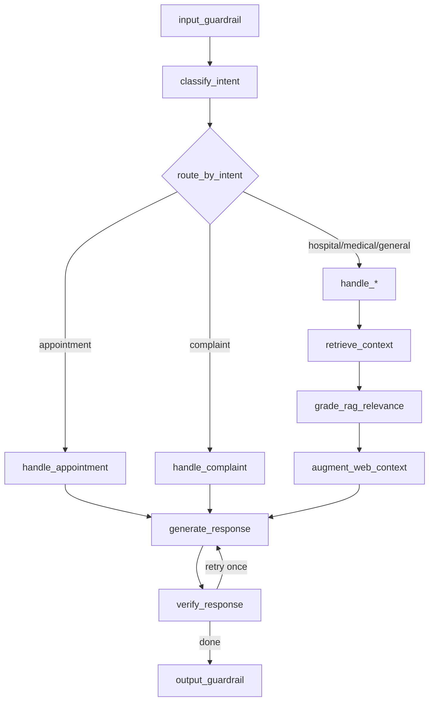

# Agent katmanı (`hospitai_agent`)

Bu dosya **adım 5** çıktısıdır: LangGraph sohbet akışının dosya haritası ve kısa davranış özeti.

## Akış (yüksek seviye)

- **Güvenlik:** giriş ve çıkışta `safety` modülü.
- **Niyet:** `intent.py` (anahtar kelime + LLM).
- **Araçlar:** randevu slotları, randevu listesi, ticket listesi / referans — platform `ChatWorkflowTools` ile enjekte edilir (`configure_workflow_tools`).
- **RAG + kalite (CRAG-lite):** `retrieve_context` → `grade_rag_relevance` (alakasız chunk’ları düşürür) → `augment_web_context` (RAG boşsa ve `TAVILY_API_KEY` varsa kısa web özeti) → `generate_response` → `verify_response` (kanıta uyum + soru adresi; en fazla bir kez sıkı yeniden üretim, hâlâ zayıfsa güvenli kısa mesaj).
- **Yanıt:** `generate_response` (LLM veya araç çıktısı düşmesi); `user_message_tr` alanı varsa öncelikli özet.

## Paket yapısı (`graph/`)

| Dosya                  | Rol                                                                                                 |
| ---------------------- | --------------------------------------------------------------------------------------------------- |
| `graph/__init__.py`    | Dış API: `run_chat`, `iter_chat_sse`, `build_graph`, `configure_workflow_tools`, `invalidate_graph` |
| `graph/state_types.py` | `GraphState` TypedDict; `ChatState` ↔ graph dönüşümleri                                             |
| `graph/prompts.py`     | Niyet başına sistem prompt’ları ve `GENERAL_FALLBACK`                                               |
| `graph/registry.py`    | Platform araç bağlaması (`get_workflow_tools`)                                                      |
| `graph/routing.py`     | `route_by_intent`; mesajdan randevu / talep listesi heuristikleri                                   |
| `graph/nodes.py`       | LangGraph düğümleri: güvenlik, niyet, RAG çekimi, araçlar, üretim                                   |
| `graph/quality.py`     | RAG alaka notu, isteğe bağlı Tavily web özeti, üretim sonrası doğrulama                             |
| `graph/builder.py`     | `StateGraph` kurulumu, derlenmiş graf önbelleği                                                     |
| `graph/chat_runner.py` | `run_chat` / `iter_chat_sse` (SSE: `streaming.py`)                                                  |
| `graph/streaming.py`   | Token parçası ayrıştırma, `postprocess_chat_result`, SSE satırı                                     |

## Paket dışı (aynı seviye)

| Dosya                                                       | Rol                                    |
| ----------------------------------------------------------- | -------------------------------------- |
| `state.py`                                                  | `ChatState` dataclass                  |
| `workflow_tools.py`                                         | Platform arayüzü (`ChatWorkflowTools`) |
| `intent.py`, `safety.py`, `llm_client.py`, `llm_profile.py` | Sınıflandırma, güvenlik, model         |
| `slot_params.py`, `ticket_reference.py`                     | Mesajdan parametre çıkarma             |
| `rag_profile.py`, `vector_db.py`, …                         | RAG altyapısı                          |

## Nereden başlamalı?

- Yeni bir **sohbet düğümü** eklemek: `graph/nodes.py` + `graph/builder.py` kenarları.
- **Yeni intent / yönlendirme:** `intent.py` + `graph/routing.py` + `graph/prompts.py`.
- **Yeni araç:** `workflow_tools.py` + backend `application/chat/tools.py` + `graph/nodes.py` içinde çağrı.

## Import notu

Uygulama kodu `from hospitai_agent.graph import run_chat` şeklinde kullanmaya devam eder; `graph` bir **paket**tir (`graph/` dizini).
